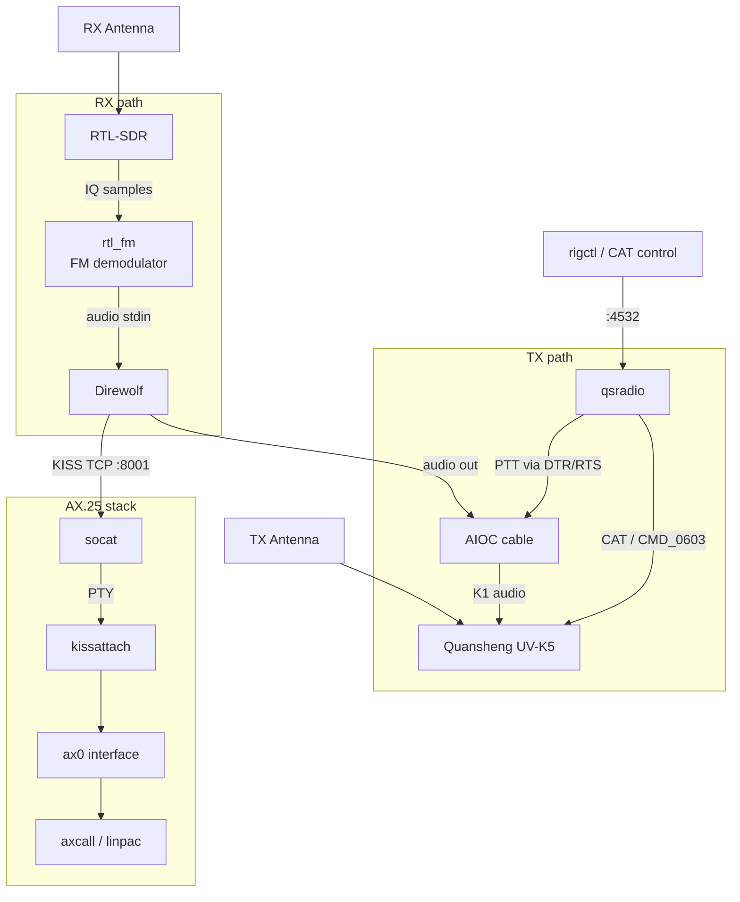
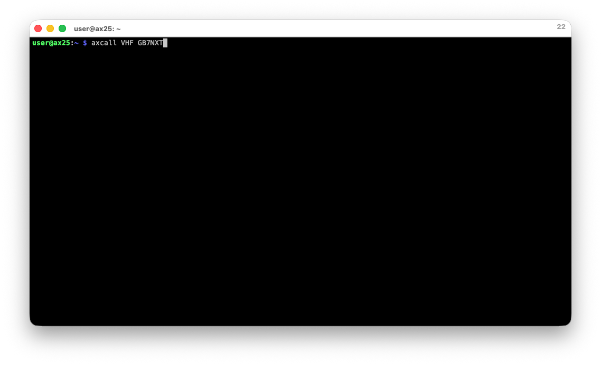
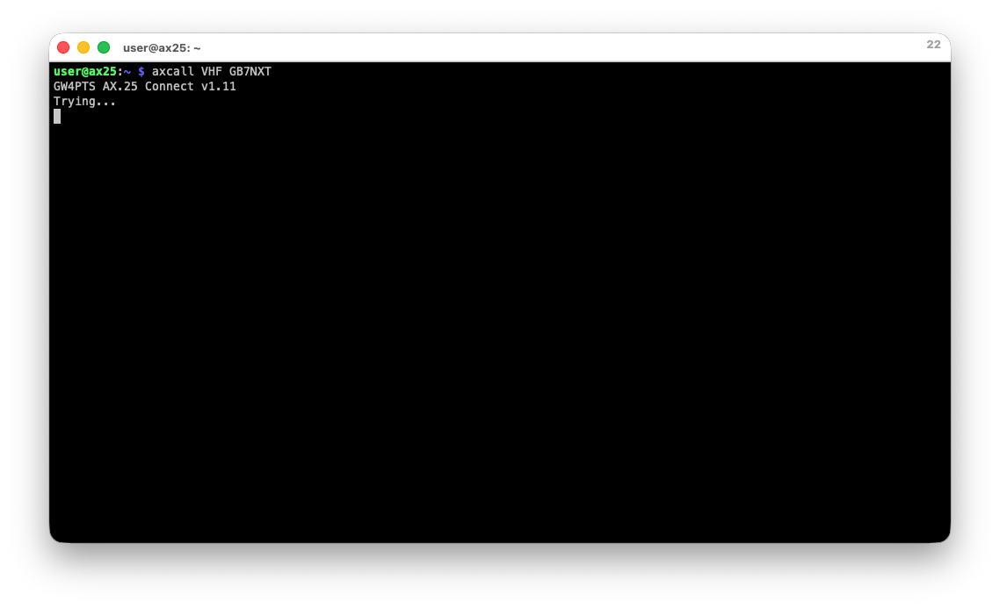
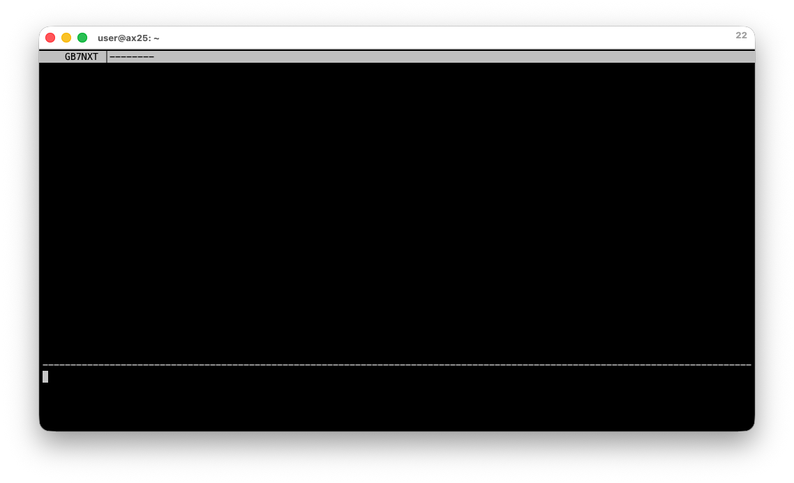
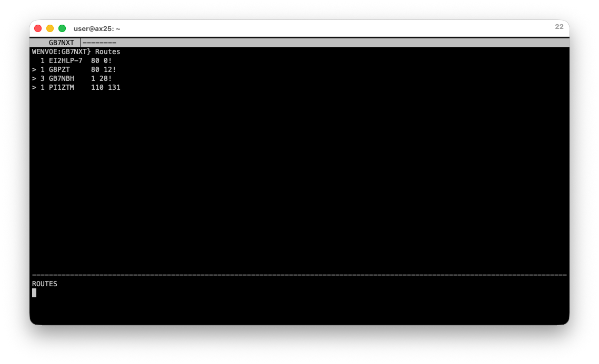
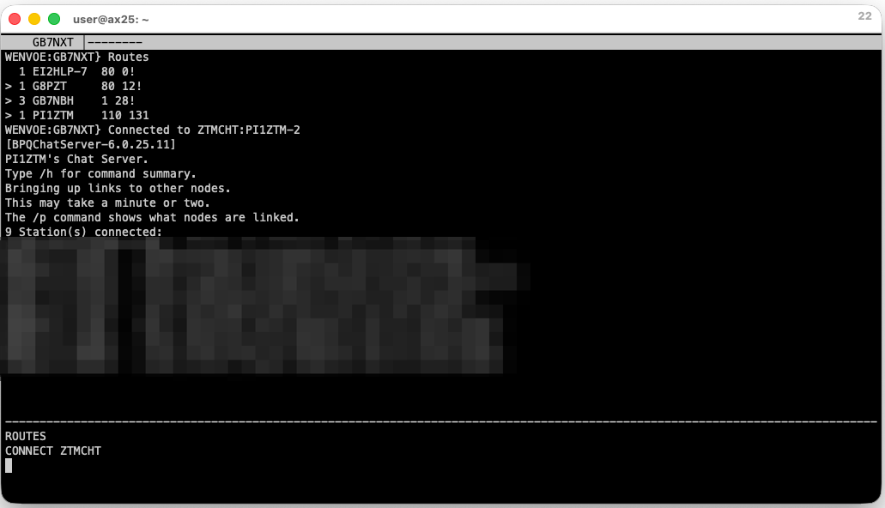

# qsradio

Adds CAT control to the Quansheng UV-K5. Works with Direwolf, WSJT-X,
fldigi, and any rigctld compatible client.

CAT control (Computer Aided Transceiver) is the serial interface that lets
software drive a radio. Tuning frequencies, switching modes, keying PTT,
adjusting power. Many transceivers support it natively. The Quansheng UV-K5
does not have a standardised CAT interface.

qsradio implements the UV-K5 serial protocol and exposes a rigctld-compatible
TCP interface on port 4532. Any software that supports hamlib can then drive
the radio.

## Why this exists

The Quansheng UV-K5 is a cheap VHF/UHF transceiver that has been 
thoroughly reverse-engineered.

Paired with an [AIOC cable](https://github.com/skuep/AIOC) it integrates well with software. 
The AIOC can provide USB serial, USB audio, and PTT over a single
connection. This means applications like Direwolf can transmit and receive without any additional
software.

What the AIOC does not natively provide is software control of the radio's parameters.
Frequency, mode, bandwidth, squelch, and transmit power all require manual
operation at the keypad. And that's perfectly fine for many setups. For
others (running headless on a Raspberry Pi, automatic frequency following in
WSJT-X, switching between repeaters without physical access to the radio) it
becomes the limiting factor. In my case, it's because I'm lazy, and don't trust myself to
manually apply settings each time I operate. 

I built qsradio as a means to provide CAT control for the Quansheng. 
It implements the UV-K5 serial protocol and exposes
a standard rigctld CAT interface on port 4532. Paired with the [headless-cat firmware](#firmware),
I've extended the radio's UART to support live frequency and mode changes.

[QuanshengDock](https://github.com/nicsure/QuanshengDock) provides similar
capability. A C# GUI Application, also with its own firmware.

qsradio takes a different approach, a headless command-line tool that runs on Linux,
macOS, and Windows.

It also adds a `PKTFM` mode that configures the BK4819 audio chain
specifically for AFSK and FSK signals. De-emphasis is bypassed,
voice-oriented filters are disabled, and the RX compander is switched off.

## Firmware

**Full capability requires the headless-cat firmware.** Flash it once; it
persists across power cycles. The firmware is maintained separately at
[github.com/muurk/uv-k5-firmware-headless-cat](https://github.com/muurk/uv-k5-firmware-headless-cat).

**Flash in browser (Chrome or Edge):**
[Flash headless-cat](https://egzumer.github.io/uvtools/?firmwareURL=https://raw.githubusercontent.com/muurk/uv-k5-firmware-headless-cat/headless-cat/f4hwn.headless-cat.packed.bin)

**Flash with k5prog:** download
[f4hwn.headless-cat.packed.bin](https://raw.githubusercontent.com/muurk/uv-k5-firmware-headless-cat/headless-cat/f4hwn.headless-cat.packed.bin)
and run:

```bash
k5prog -F f4hwn.headless-cat.packed.bin -p /dev/ttyACM0 -YYY
```

The headless-cat firmware is a fork of
[F4HWN v4.3](https://github.com/armel/uv-k5-firmware-custom), which in turn
builds on the work of [egzumer](https://github.com/egzumer/uv-k5-firmware-custom)
and [DualTachyon](https://github.com/DualTachyon/uv-k5-firmware). The
protocol documentation by
[amnemonic](https://github.com/amnemonic/Quansheng_UV-K5_Firmware) was
instrumental in understanding the serial framing.

## Installing qsradio

Download the binary for your platform from the
[releases page](https://github.com/muurk/qsradio/releases):

```bash
# Raspberry Pi (arm64)
curl -L https://github.com/muurk/qsradio/releases/latest/download/qsradio-linux-arm64 \
    -o qsradio && chmod +x qsradio

# Confirm it works
./qsradio version
```

Binaries are also available for Linux amd64/armv7, macOS, and Windows.
See [Building from source](#building-from-source) if you prefer to compile.

## Quick start

With the headless-cat firmware flashed (see the Firmware section above)
and the AIOC connected:

```bash
# Verify the radio responds.
# Linux: /dev/ttyACM0  macOS: /dev/cu.usbmodem...  Windows: COM5
# On a Pi, run: dmesg | grep tty  after plugging in to find the device.
qsradio info --port /dev/ttyACM0

# Start the rigctld bridge.
qsradio serve --port /dev/ttyACM0 --rigctld :4532

# Point any hamlib client at localhost:4532.
```

## Commands

| Command | Description |
|---------|-------------|
| `qsradio serve` | Start the rigctld bridge |
| `qsradio info` | Read firmware version and capabilities |
| `qsradio set-freq` | Tune VFO A to a frequency |
| `qsradio dump-eeprom` | Dump the full EEPROM to stdout |
| `qsradio reg-read` | Read a BK4819 register directly (diagnostic) |
| `qsradio rawdump` | Dump raw serial frames (diagnostic) |

### Checking the connection

```
$ qsradio info --port /dev/ttyACM0
firmware: headless-cat v4.3
CMD_0601/0602 (BK4819 reg access): YES  live freq=144.937500 MHz
RSSI:                              raw=142  (-89 dBm)
CMD_0527      (RSSI):              YES
```

### Starting the rigctld bridge

Each received command is logged verbatim, so it is easy to see exactly what
each client is sending.

```
$ qsradio serve --port /dev/ttyACM0 --rigctld :4532
connected: headless-cat v4.3
WARNING: PTT commands from rigctld clients will transmit RF.
rigctld listening on :4532
2026/05/28 22:15:43 rigctl: client connected: 127.0.0.1:52341
2026/05/28 22:15:43 rigctl: [127.0.0.1:52341] rx: "dump_state"
2026/05/28 22:15:43 rigctl: [127.0.0.1:52341] rx: "V VFOA"
2026/05/28 22:15:43 rigctl: [127.0.0.1:52341] rx: "F 144937500"
2026/05/28 22:15:43 rigctl: [127.0.0.1:52341] rx: "M PKTFM 25000"
2026/05/28 22:15:51 rigctl: [127.0.0.1:52341] rx: "T VFOA 1"
2026/05/28 22:15:54 rigctl: [127.0.0.1:52341] rx: "T VFOA 0"
2026/05/28 22:15:54 rigctl: [127.0.0.1:52341] rx: "l RAWSTR"
```

### Tuning directly

```
$ qsradio set-freq --port /dev/ttyACM0 --freq 144937500
open+handshake:    143ms
get freq+mode:     51ms
  before: 144.812500 MHz  mode=FM  bw=25000 Hz
live BK4819 write: 8ms  (two CMD_0602 register writes, no reboot needed)
live BK4819 read:  6ms  (two CMD_0601 register reads)
  after:  144.937500 MHz  (target 144.937500 MHz)
  radio tuned OK (no reboot needed)
```

### Testing with rigctl

```bash
# Set PKTFM mode (flat audio, optimised for digital modes).
rigctl -m 2 -r localhost:4532 M PKTFM 25000

# Tune to a frequency.
rigctl -m 2 -r localhost:4532 F 144937500

# Read S-meter (raw 0-511 BK4819 value; dBm = raw/2 - 160).
rigctl -m 2 -r localhost:4532 l RAWSTR
142
```

## Building from source

Requires Go 1.25 or newer. No C toolchain needed (CGO is disabled).

```bash
make build   # current platform
make dist    # all release targets: Linux amd64/arm64/armv7, macOS, Windows
make check   # vet + fmt + tests
```

## Packet radio

Here's what this enables in practice: a complete AX.25 packet station built from cheap hardware, connecting to a local node and onward to other nodes.

### Using the Quansheng for both RX & TX 

My attempts to use the Quansheng for both RX & TX have been fraught with failure. 
So I'm including this purely as reference. In my experience, the Quansheng simply isn't suitable for receiving digital modes. 

I'd love to be proven wrong. Maybe there's a magic setting I simply haven't found. Please.

Here's the Direwolf config that I used:

```
ACHANNELS 1
ADEVICE plughw:1,0 plughw:1,0

CHANNEL 0
MYCALL <your-callsign>
MODEM 1200

PTT RIG 2 localhost:4532

KISSPORT 8001
AGWPORT off
```

Before starting Direwolf, use `rigctl` to configure the radio via qsradio's
CAT interface.

```bash
# qsradio must be running first: ./qsradio serve --port /dev/ttyACM0 --rigctld :4532

# Tune to the packet frequency
rigctl -m 2 -r localhost:4532 F 144937500

# PKTFM mode: disables de-emphasis and voice filters for flat AFSK audio
rigctl -m 2 -r localhost:4532 M PKTFM 25000

# TX power (1.0 = High, scale is 0.0-1.0)
rigctl -m 2 -r localhost:4532 L RFPOWER 1.0

# Mic gain to control FM deviation on transmit.
rigctl -m 2 -r localhost:4532 L MICGAIN 0.333
```

Start Direwolf and start listening:

```
Dire Wolf version 1.7
Audio device for both receive and transmit: plughw:1,0  (channel 0)
Channel 0: 1200 baud, AFSK 1200 & 2200 Hz, A+, 44100 sample rate.
Ready to accept KISS TCP client application 0 on port 8001 ...
```

I left this running for a long time. Via my SDR I could see several beacons from
a node in my neighbourhood. But Direwolf couldn't.

I did a lot more testing, capturing audio from the Quansheng, digging into its guts. I just couldn't make it work as a receiver.

### Using a cheap RTL-SDR for receive, UV-K5 for transmit

The solution that worked for me was to split the jobs.

I had a spare RTL-SDR v3 which I was using to monitor while Direwolf was running. So I figured, 
why not allow this to act as the RX path, and let the Quansheng put its feet up until it's time to TX.

The UV-K5 handles transmit. qsradio provides the CAT
interface that ties it together.



The RTL-SDR is connected to a cheap discone antenna. `rtl_fm` demodulates the FM audio and
pipes it directly into Direwolf's stdin.

qsradio runs as a rigctld server
and handles PTT when Direwolf needs to transmit.

### Hardware Setup 

This is how I had things setup:

* Raspberry Pi 4
* AIOC connected via USB to the Quansheng
* RTL-SDR connected via USB 

```
$ lsusb
Bus 001 Device 024: ID 1209:7388 Generic All-In-One-Cable
Bus 001 Device 030: ID 0bda:2838 Realtek Semiconductor Corp. RTL2838 DVB-T
```

The AIOC's UART shows up as `/dev/ttyACM0`.

A quick `rtl_test` confirms it's working:

```
$ rtl_test -t
Found 1 device(s):
  0:  Realtek, RTL2838UHIDIR, SN: 00000001

Using device 0: Generic RTL2832U OEM
Found Rafael Micro R820T tuner
Supported gain values (29): 0.0 0.9 1.4 ... 49.6
```

### Software Setup

**Terminal 1: qsradio rigctld**

Start qsradio against the AIOC (see [Installing qsradio](#installing-qsradio)
if you haven't already):

```
$ ./qsradio serve --port /dev/ttyACM0 --rigctld :4532
connected: headless-cat v4.3
WARNING: PTT commands from rigctld clients will transmit RF.
rigctld listening on :4532
```

Leave this running. It accepts PTT and frequency commands from Direwolf on
port 4532.

**Configuring the radio**

With qsradio running, use `rigctl` to configure the UV-K5 before starting
the receive pipeline. Set the frequency, switch to packet mode, and set
transmit power:

```bash
# Tune to 144.9375 MHz (GB7NXT, local to where this was tested)
rigctl -m 2 -r localhost:4532 F 144937500

# PKTFM mode: bypasses de-emphasis and voice filters for flat AFSK audio
rigctl -m 2 -r localhost:4532 M PKTFM 25000

# TX power: 1.0 = High (scale 0.0-1.0)
rigctl -m 2 -r localhost:4532 L RFPOWER 1.0

# Mic gain: scale is 0.0-1.0
rigctl -m 2 -r localhost:4532 L MICGAIN 0.333
```

Verify the settings were applied:

```
$ rigctl -m 2 -r localhost:4532 f
144937500
$ rigctl -m 2 -r localhost:4532 m
FM-D
25000
$ rigctl -m 2 -r localhost:4532 l RFPOWER
1
$ rigctl -m 2 -r localhost:4532 l MICGAIN
0.333333
```

**Terminal 2: RTL-SDR receive pipeline**

Create `direwolf.conf`:

```
ACHANNELS 1
ADEVICE stdin plughw:1,0

CHANNEL 0
MYCALL <your-callsign>
MODEM 1200

PTT RIG 2 localhost:4532

KISSPORT 8001
AGWPORT off
```

`PTT RIG 2 localhost:4532` is Direwolf using qsradio's CAT interface for
PTT. When Direwolf needs to transmit, it sends a key command to qsradio,
which asserts PTT on the UV-K5 via the AIOC modem control lines.

Here's how I started the pipeline to provide Direwolf with input from the SDR.

`rtl_fm` demodulates narrowband FM from the packet
frequency and pipes the audio directly into Direwolf.

Breaking down the flags:
* `-f` is the frequency
* `-M fm` is narrowband FM demodulation
* `-s 22050` is the output sample rate, matching Direwolf's `-r 22050`
* `-g 49.6` is the receiver gain in dB

```
$ rtl_fm -f 144.9375M -M fm -s 22050 -g 49.6 - | \
    direwolf -c direwolf.conf -r 22050 -t 0

Dire Wolf version 1.7
Audio input device for receive: stdin  (channel 0)
Audio out device for transmit: plughw:1,0  (channel 0)
Channel 0: 1200 baud, AFSK 1200 & 2200 Hz, A+, 22050 sample rate.
Ready to accept KISS TCP client application 0 on port 8001 ...
```

### Receiving packets

Within a couple of minutes, frames from nearby nodes start appearing.
Here's what arrived from GB7NXT:

```
GB7NXT audio level = 57(4/5)    ||||_____
[0.1] GB7NXT>BEACON:GB7NXT PACKET NODE AND MAILBOX. Connect to WENVOE for
node, NXTCHT for chat and NXTBBS for mail

GB7NXT audio level = 59(4/6)    ||||_____
[0.1] GB7NXT>BEACON:GB7NXT PACKET NODE AND MAILBOX. Connect to WENVOE for
node, NXTCHT for chat and NXTBBS for mail
```

Signal level 57-59, four bars consistently.

NODES broadcast frames also arrive, advertising which nodes GB7NXT can reach. These populate the NET/ROM routing table across the network:

```
GB7NXT audio level = 47(4/5)    ||||_____
[0.1] GB7NXT>NODES:(UI cmd, p=0) WENVOE .. NXTCHT .. NXTBBS .. ZTMNOD ..
ZTMBBS .. ZTMCHT .. ZTMWLK .. ZTMDXC .. XR_ZTM .. IOBBS .. BORNOD .. RJJBBS

GB7NXT audio level = 51(4/5)    ||_______
[0.1] GB7NXT>NODES:(UI cmd, p=0) WENVOE .. WUENTS .. ONBPQ .. PENBBS ..
FDKMD .. BILNOD .. SICDRM .. MH4NOD .. MH4BBS .. MH4RMS .. DAYTON
```

### Bringing up the AX.25 interface

The Direwolf instance is configured to expose a KISS TCP port on 8001. The kernel's AX.25 stack is
attached via `kissattach`, which expects a TTY device, not a TCP socket.
`socat` bridges the two; it creates a PTY (a proper TTY) and transparently
connects it to Direwolf's KISS port. 

Add an entry for the port in `/etc/ax25/axports`:

```
# name  callsign   speed  paclen  window  description
VHF     MYCALL-1   1200   255     7       144.9375 MHz 1200 baud
```

(Replace `MYCALL-1` with your callsign. The port name (`VHF`) is what you
pass to `axcall`.)

In a third terminal, start the socat bridge then run kissattach:

```bash
# Bridge Direwolf's KISS TCP port to a PTY
sudo socat PTY,link=/tmp/ax25_tnc,rawer TCP:localhost:8001,retry=10,interval=1 &

# Attach the PTY to the kernel AX.25 stack
sudo kissattach /tmp/ax25_tnc VHF
```

A successful attach prints:

```
AX.25 port VHF bound to device ax0
```

Confirm the interface is up:

```
$ ip link show ax0
767: ax0: <BROADCAST,UP,LOWER_UP> mtu 255 qdisc fq_codel state UNKNOWN mode DEFAULT group default qlen 10
    link/ax25 MYCALL-1 brd QST-0 permaddr LINUX-1
```

`state UNKNOWN` is normal for AX.25 interfaces. The callsign from axports
appears as the link address, confirming the attachment is correct.

### Connecting to a node

With `ax0` up, use `axcall` to open a connected session:

```bash
axcall VHF GB7NXT
```



axcall negotiates the AX.25 connection over RF:



Connected to GB7NXT. The node shell is ready for commands:



Running `Routes` shows which nodes GB7NXT can reach via NET/ROM. PI1ZTM
(Netherlands) is reachable at quality 110:



Here I connect to the PI1ZTM chat service using `CONNECT ZTMCHT`. GB7NXT establishes an onward connection to PI1ZTM's chat server. This screenshot was taken during a live session:



## Related projects

**[QuanshengDock](https://github.com/nicsure/QuanshengDock)** by nicsure is a
desktop application (C#, WPF) that provides a rich graphical interface
for the UV-K5: spectrum display, VFO control, and audio passthrough. It
requires a separate custom firmware maintained alongside the application.
A community fork,
[QuanshengDock-mod](https://github.com/BranoSundancer/QuanshengDock-mod-om1atb)
by OM1ATB, adds a hamlib rigctld interface via a virtual COM port.
QuanshengDock is a mature project and the natural choice if you want a
GUI. 

## Acknowledgements

The UV-K5 open-source firmware community has been at this for years.
[DualTachyon](https://github.com/DualTachyon/uv-k5-firmware) produced the
original reverse-engineered firmware.
[amnemonic](https://github.com/amnemonic/Quansheng_UV-K5_Firmware) documented
the serial protocol in detail; the `libuvk5.py` reference implementation is
what this project's transport layer is built on.
[egzumer](https://github.com/egzumer/uv-k5-firmware-custom) extended that
work, and [F4HWN (armel)](https://github.com/armel/uv-k5-firmware-custom)
produced the v4.3 branch that headless-cat forks from.

[skuep's AIOC](https://github.com/skuep/AIOC) is the hardware piece that
makes the whole thing practical; three separate cables become one.

The worked example connects through GB7NXT with an onward hop to
PI1ZTM. Both are volunteer-run nodes. The packet network exists
because people give their time and equipment to keep it running, thank you.

## License

Apache 2.0. See [LICENSE](LICENSE).

The headless-cat firmware is also Apache 2.0:
[github.com/muurk/uv-k5-firmware-headless-cat](https://github.com/muurk/uv-k5-firmware-headless-cat)
